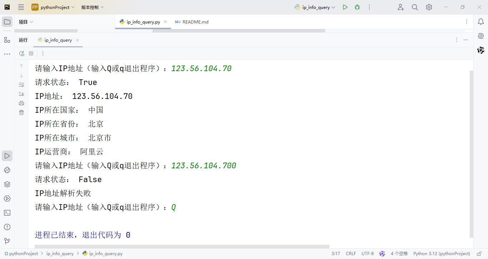

## ip_info_query
#### Author: LiRayShield
#### Date: 2024-08-08
#### Description: 该程序用于查询并显示给定IP地址的相关信息，包括位置和运营商等详细数据。用户可以通过输入IP地址来进行查询，或者输入'q'来退出程序。

----
程序流程：
1. 循环提示用户输入IP地址。
2. 如果用户输入'q'，则退出程序。
3. 否则，发送HTTP GET请求到指定API以获取IP信息。
4. 解析响应数据为JSON格式。
5. 根据返回的数据打印IP地址的相关信息。
6. 如果数据结构中缺少某些键，则捕获KeyError异常并输出错误信息。
7. 如果网络请求失败，则捕获requests.RequestException异常并输出错误信息。

---

运行截图：

---
##### 特此感谢 ***[韩小韩](https://api.vvhan.com/)*** 提供免费API服务。
